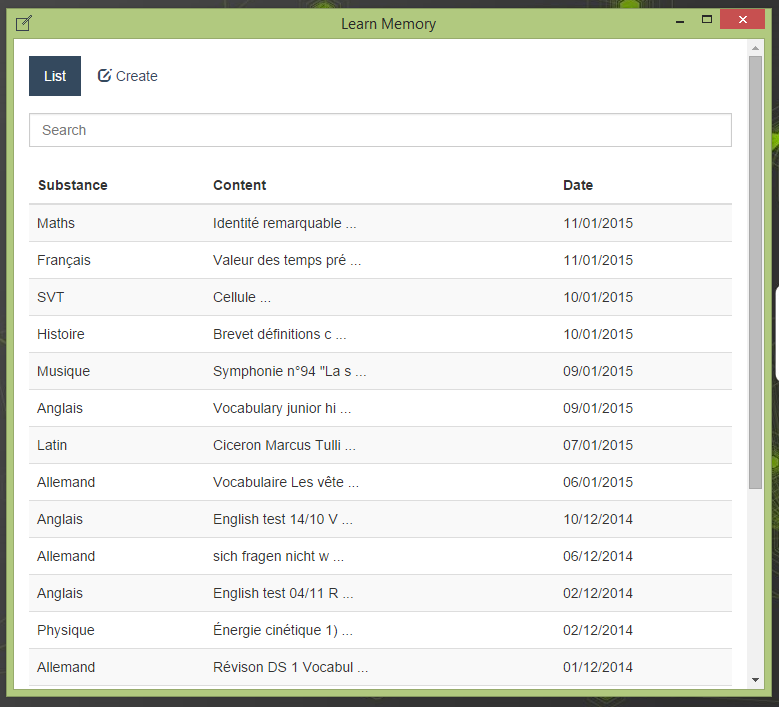

# Learn Memory for Desktop

A Node-Webkit software to learn your lesson.

## Installation

1. [Download for Windows](https://raw.githubusercontent.com/cedced19/learn-memory-desktop/master/dist/Windows.zip)
2. Extract
3. Execute `learn-memory.exe`




## Developers

### API

There are a Rest API on `http://localhost:7772/api/`.

### Save

The save is located at the same place of `.rc` files

### To compile

```bash
npm install
grunt
```