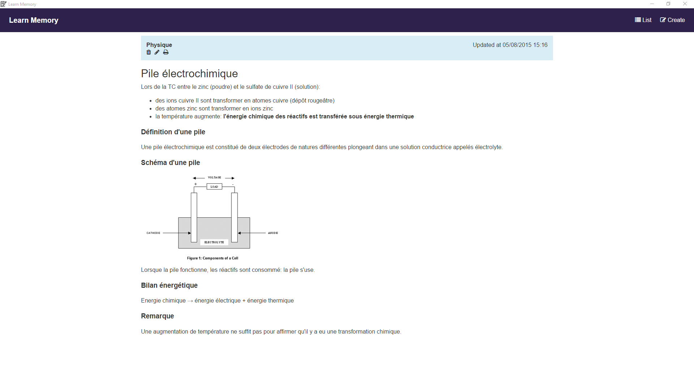

# Learn-Memory

A Node-Webkit software to learn your lesson.

## Instalation

1. [Download for Windows](https://raw.githubusercontent.com/cedced19/Learn-Memory-Desktop/master/dist/Windows.zip)
2. Extract
3. Execute `Learn-Memory.exe`

## Developers

### API

There are a Rest API on `http://localhost:9999/api/`.

### Save

The save is located at the same place of `.rc` files

### To compile

1. Do `npm install && cd app/ && npm install && cd ../`
2. Do `gulp`